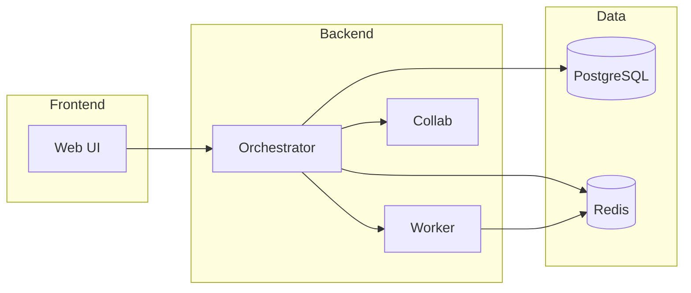

# ResearchFlow

Clinical research platform for healthcare data analysis, PHI protection, and manuscript generation. HIPAA-aware by design with a 20-stage workflow pipeline and real-time collaboration.

## Overview

ResearchFlow (ROS — Research Operating System) provides:

- **20-stage workflow pipeline**: Data ingestion, literature review, IRB, PHI scanning, analysis, manuscript drafting, review, and dissemination
- **Dual-mode operation**: DEMO (synthetic data) and LIVE (real PHI with governance)
- **Real-time collaboration**: WebSocket-based editing and commenting
- **AI-powered manuscript generation**: IMRaD structure, literature integration, and export

## Architecture



| Component | Port | Description |
|-----------|------|-------------|
| Web | 5173 (dev), 80 (prod) | React frontend (Nginx) |
| Orchestrator | 3001 | Node.js API (Express) |
| Worker | 8000 | Python FastAPI (compute, workflow, APIs) |
| Collab | 1234 | Yjs real-time collaboration |
| PostgreSQL | 5432 | Primary database |
| Redis | 6379 | Cache and job queue |

An alternate ASCII diagram is in [docs/deployment/docker-guide.md](docs/deployment/docker-guide.md).

## Quick Start

**Prerequisites:** Docker Engine 24+ and Docker Compose 2.20+

### Environment setup

- **Development:** Copy `cp .env.example .env` and edit with API keys (e.g. `ANTHROPIC_API_KEY`, `OPENAI_API_KEY`) if using AI features.
- **Production:** Copy `cp .env.production.template .env.production` and configure per [docs/deployment/env-contract.md](docs/deployment/env-contract.md).

```bash
git clone https://github.com/ry86pkqf74-rgb/researchflow-production.git
cd researchflow-production
cp .env.example .env
# Edit .env with API keys (e.g. ANTHROPIC_API_KEY, OPENAI_API_KEY) if using AI features
docker compose up -d
```

For a production-like local run: `./scripts/deploy-local.sh` (uses `docker-compose.prod.yml`; see [docs/deployment/](docs/deployment/)).

**Access:**

| Service | URL |
|---------|-----|
| Web UI | http://localhost:5173 |
| Orchestrator API | http://localhost:3001/api/health |
| Worker API (Swagger) | http://localhost:8000/docs |
| Worker API (ReDoc) | http://localhost:8000/redoc |
| Collab health | http://localhost:1234/health |

## Deployment

See [docs/deployment/](docs/deployment/) for Docker production, env contract, and secrets.

- **Docker (dev and prod):** [docs/deployment/docker-guide.md](docs/deployment/docker-guide.md)
- **Local development (without full Docker):** [docs/LOCAL_DEV.md](docs/LOCAL_DEV.md)
- **Backend deployment:** [docs/BACKEND_DEPLOYMENT_GUIDE.md](docs/BACKEND_DEPLOYMENT_GUIDE.md)

## Documentation

| Document | Description |
|----------|-------------|
| [docs/STAGES.md](docs/STAGES.md) | 20-stage pipeline input/output specs |
| [docs/DEVELOPER.md](docs/DEVELOPER.md) | Adding stages, testing, conventions |
| [docs/api/](docs/api/) | Orchestrator OpenAPI (Node) |
| [CONTRIBUTING.md](CONTRIBUTING.md) | Contribution and PR process |

Worker API docs (FastAPI) are served at `/docs` and `/redoc` when the worker is running.

## Design System

Governance-aware UI tokens and components:

- **Design tokens:** [packages/design-tokens](packages/design-tokens) — colors, spacing, typography (Style Dictionary)
- **UI library:** [packages/ui](packages/ui) — React components (PHIGateBanner, ModelTierBadge, etc.)
- **Design docs:** [docs/design/](docs/design/) — tokens, component inventory, accessibility

```bash
cd packages/design-tokens && npm install && npm run build
cd ../ui && npm install
```

## License

MIT
