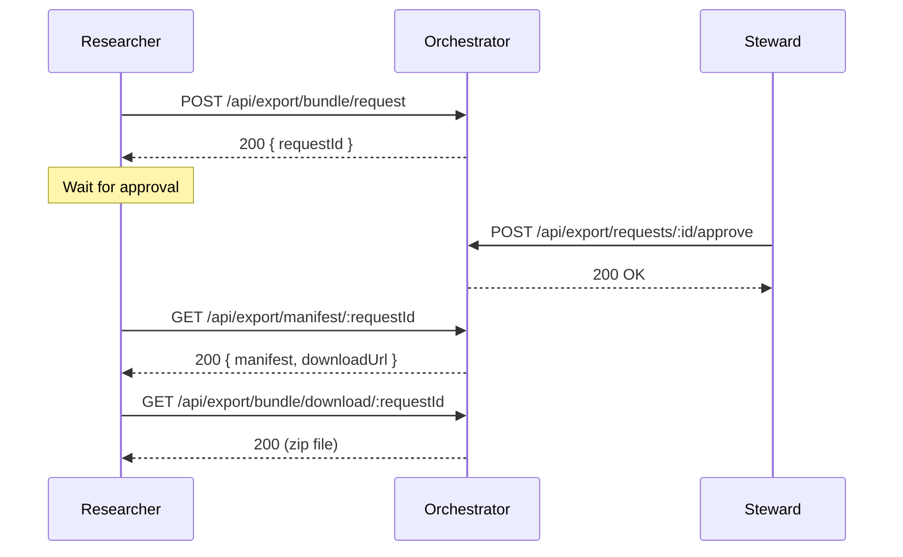
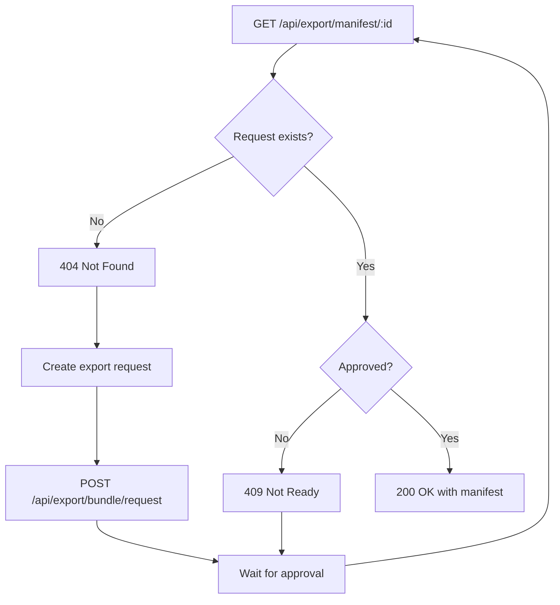

# Export Manifest API

## Overview

The export manifest endpoint provides metadata about reproducibility bundles without requiring a full archive download.

## Endpoint

```
GET /api/export/manifest/:requestId
```

### Authentication

Requires: `RESEARCHER` role or higher

### Path Parameters

| Parameter | Type | Description |
|-----------|------|-------------|
| `requestId` | string (UUID) | The unique identifier for the export bundle request |

## Response Codes

### 200 OK - Manifest Available

The bundle has been approved and the manifest is ready.

```json
{
  "success": true,
  "requestId": "550e8400-e29b-41d4-a716-446655440000",
  "manifest": {
    "version": "1.0",
    "researchId": "abc-123",
    "createdAt": "2026-02-07T12:00:00Z",
    "files": [
      {
        "path": "data/input.csv",
        "size": 1024,
        "hash": "sha256:..."
      }
    ],
    "metadata": {
      "includeTopics": true,
      "includeSAPs": true,
      "includeArtifacts": true
    }
  },
  "downloadUrl": "/api/export/bundle/download/550e8400-e29b-41d4-a716-446655440000"
}
```

### 404 Not Found - Request Does Not Exist

The export request has not been created yet.

```json
{
  "error": "Export request not found",
  "code": "REQUEST_NOT_FOUND",
  "message": "The manifest will be available after the export bundle is generated and approved."
}
```

**Expected Behavior**: This is normal if the export workflow has not been initiated. The client should:
1. Create an export request via `POST /api/export/bundle/request`
2. Wait for approval
3. Then fetch the manifest

### 409 Conflict - Bundle Not Ready

The export request exists but hasn't been approved yet.

```json
{
  "error": "Bundle not ready",
  "code": "BUNDLE_NOT_READY",
  "message": "Manifest is only available after bundle is approved.",
  "currentStatus": "pending"
}
```

**Possible statuses**:
- `pending`: Awaiting steward approval
- `denied`: Request was denied
- `failed`: Bundle generation failed

**Expected Behavior**: The client should wait for approval or check the status via `GET /api/export/requests?projectId=...`

### 410 Gone - Bundle Expired

The bundle download link has expired.

```json
{
  "error": "Bundle has expired",
  "code": "BUNDLE_EXPIRED",
  "expiredAt": "2026-02-06T12:00:00Z"
}
```

**Expected Behavior**: Create a new export request.

### 500 Internal Server Error

Failed to generate the manifest.

```json
{
  "error": "Failed to generate manifest",
  "code": "MANIFEST_GENERATION_FAILED",
  "details": "..."
}
```

## Workflow

### Complete Export Workflow



### When Manifest Returns 404



## Implementation Notes

### Durable Fix Considerations

1. **Clear Response Messages**: Each error code includes a message explaining what the client should do next.

2. **Consistent Status Codes**:
   - `404`: Resource doesn't exist yet
   - `409`: Resource exists but not ready (intentional state)
   - `410`: Resource existed but is no longer available

3. **No Silent Failures**: All states return explicit error codes and messages.

4. **Idempotent**: Calling the manifest endpoint multiple times for the same requestId produces the same result.

## Related Endpoints

- `POST /api/export/bundle/request` - Create a new export request
- `GET /api/export/requests?projectId=...` - List export requests
- `GET /api/export/bundle/download/:requestId` - Download the full bundle
- `POST /api/export/requests/:id/approve` - Approve an export request (Steward only)
- `POST /api/export/requests/:id/deny` - Deny an export request (Steward only)

## Testing

```bash
# 1. Create export request
curl -X POST http://localhost:3001/api/export/bundle/request \
  -H "Authorization: Bearer $TOKEN" \
  -H "Content-Type: application/json" \
  -d '{"researchId":"test-123","reason":"Testing"}'

# Response: { "requestId": "550e8400-..." }

# 2. Check manifest (will return 409 if not approved yet)
curl http://localhost:3001/api/export/manifest/550e8400-... \
  -H "Authorization: Bearer $TOKEN"

# 3. Approve request (as Steward)
curl -X POST http://localhost:3001/api/export/requests/550e8400-.../approve \
  -H "Authorization: Bearer $STEWARD_TOKEN"

# 4. Check manifest again (should now return 200)
curl http://localhost:3001/api/export/manifest/550e8400-... \
  -H "Authorization: Bearer $TOKEN"
```

## See Also

- [Reproducibility Bundle Documentation](../reproducibility-bundle.md)
- [Governance Mode](../governance.md)
- [RBAC Permissions](../rbac.md)
