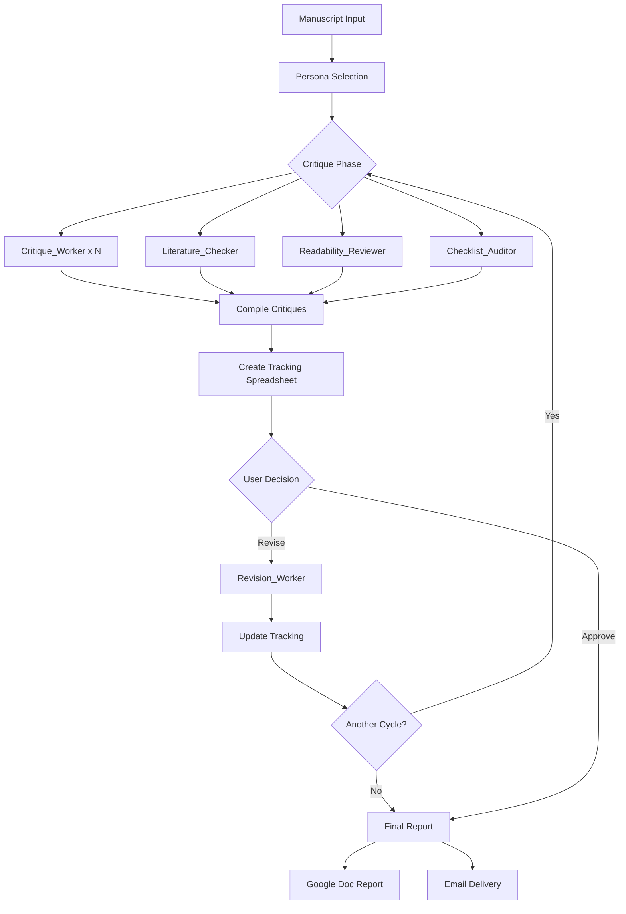

# Agent: Peer Review Simulator

**Imported from LangSmith:** 2026-02-08  
**Agent Type:** Multi-agent system with coordinator and 5 specialized subagents  
**Primary Focus:** Rigorous academic manuscript peer review simulation  

## Overview

The Peer Review Simulator is a comprehensive multi-agent system that mimics the rigor of top-tier academic journal peer review processes. It helps researchers strengthen their manuscripts before submission by running simulated multi-persona peer reviews, generating adversarial critiques, coordinating revisions, and iterating through review cycles until manuscripts meet publication-quality standards.

## Architecture

### Main Agent: Peer Review Coordinator
- **Role:** Orchestrates the full peer review lifecycle
- **Capabilities:**
  - Manuscript intake (pasted text, Google Docs, preprint URLs)
  - Persona selection and management
  - Critique coordination and compilation
  - Revision orchestration
  - Multi-cycle review iteration
  - Output delivery (reports, spreadsheets, emails)

### Subagents

| Subagent | Purpose | Integration Point |
|----------|---------|-------------------|
| **Critique_Worker** | Generates adversarial peer review critiques from specific reviewer personas (methodologist, statistician, ethics reviewer, domain expert) | Invoked once per persona during critique phase |
| **Revision_Worker** | Produces revised manuscripts and point-by-point response letters | Invoked during revision phase after critiques compiled |
| **Literature_Checker** | Verifies references, citations, novelty claims, and literature coverage | Runs in parallel with Critique_Workers |
| **Readability_Reviewer** | Assesses writing quality, clarity, logical flow, abstract/title effectiveness | Runs in parallel with Critique_Workers |
| **Checklist_Auditor** | Item-by-item audit against reporting checklists (CONSORT, STROBE, PRISMA, etc.) | Runs in parallel with Critique_Workers |

## Integration with ResearchFlow Workflow

### Relationship to Existing Systems

This agent **complements** the existing peer review infrastructure:

#### Existing: `packages/manuscript-engine/src/services/peer-review.service.ts`
- **Scope:** Automated scoring and basic critique generation
- **Focus:** Quick validation within workflow stages
- **Output:** Structured scores, recommendations, basic comments
- **Use case:** In-pipeline quality checks during manuscript generation

#### New: `agent-peer-review-simulator`
- **Scope:** Deep, multi-persona rigorous review simulation
- **Focus:** Pre-submission manuscript strengthening
- **Output:** Comprehensive critiques, detailed reports, revision tracking, iterative improvements
- **Use case:** Final manuscript refinement before external submission

### Integration Points

#### 1. **Stage 13: Internal Review** (`stage_13_internal_review.py`)
The Peer Review Simulator can be invoked as an enhanced review option:

```python
# In stage_13_internal_review.py
if context.config.get("use_langsmith_peer_review", False):
    # Invoke LangSmith Peer Review Simulator via bridge
    peer_review_result = await call_langsmith_agent(
        agent_id="peer-review-simulator",
        manuscript=manuscript_payload,
        personas=["methodologist", "statistician", "ethics_reviewer", "domain_expert"],
        study_type=context.config.get("study_type", "observational")
    )
else:
    # Use existing peer-review.service.ts
    peer_review_result = await self.call_manuscript_service(...)
```

#### 2. **Stage 11: Iteration** (`stage_11_iteration.py`)
Can be used to generate comprehensive feedback during iterative refinement cycles.

#### 3. **Standalone Tool**
Can be invoked independently for manuscripts that have already been generated outside the workflow.

## Workflow Lifecycle



## Reporting Standards Supported

| Study Type | Checklist | Reference |
|------------|-----------|-----------|
| Randomized Controlled Trial | CONSORT | [link](https://www.consort-statement.org/) |
| Observational Study | STROBE | [link](https://www.strobe-statement.org/) |
| Systematic Review/Meta-analysis | PRISMA | [link](https://www.prisma-statement.org/) |
| Diagnostic Accuracy | STARD | [link](https://www.equator-network.org/reporting-guidelines/stard/) |
| Quality Improvement | SQUIRE | [link](https://www.squire-statement.org/) |
| Animal Research | ARRIVE | [link](https://arriveguidelines.org/) |
| Case Reports | CARE | [link](https://www.care-statement.org/) |

## Tool Dependencies

### LangSmith/LangChain Tools
- `google_docs_read_document` - Read manuscripts from Google Docs
- `google_docs_create_document` - Create final review reports
- `google_docs_append_text` - Append content to reports
- `google_docs_replace_text` - Update reports across review cycles
- `read_url_content` - Fetch manuscripts from preprint servers
- `tavily_web_search` - General web search for guidelines
- `exa_web_search` - Neural search for academic content
- `google_sheets_create_spreadsheet` - Create critique tracking
- `google_sheets_write_range` - Write structured data
- `google_sheets_append_rows` - Add critique rows
- `gmail_send_email` - Email final reports

### ResearchFlow Bridge Integration
To enable this agent within ResearchFlow workflows:

1. **Add to AI Bridge configuration** (`services/orchestrator/src/config/ai-bridge.ts`):
```typescript
export const LANGSMITH_AGENTS = {
  ...
  'peer-review-simulator': {
    url: process.env.LANGSMITH_PEER_REVIEW_URL,
    apiKey: process.env.LANGSMITH_API_KEY,
    agentId: process.env.LANGSMITH_PEER_REVIEW_AGENT_ID
  }
};
```

2. **Add environment variables** (`.env`):
```bash
LANGSMITH_PEER_REVIEW_URL=https://api.smith.langchain.com/v1/agents
LANGSMITH_PEER_REVIEW_AGENT_ID=<agent-id-from-langsmith>
LANGSMITH_API_KEY=<your-api-key>
```

3. **Update stage configuration** to support LangSmith option:
```json
{
  "stage_13_config": {
    "use_langsmith_peer_review": true,
    "personas": ["methodologist", "statistician", "ethics_reviewer", "domain_expert"],
    "max_review_cycles": 3,
    "enable_google_docs_output": true
  }
}
```

## Default Reviewer Personas

1. **Methodologist** - Study design, statistical methods, power analysis, randomization, blinding, reproducibility
2. **Domain Expert** - Scientific merit, novelty, relevance, accuracy of claims, literature context
3. **Ethics Reviewer** - IRB/ethics approval, informed consent, COI, data privacy, responsible conduct
4. **Statistician** - Statistical analyses, effect sizes, confidence intervals, p-values, multiple comparisons

Custom personas can be specified by users when needed.

## Output Artifacts

1. **Chat Summary** - Immediate feedback with top critiques, severity counts, recommendations
2. **Google Doc Report** - Comprehensive review report with:
   - Executive summary
   - Full critiques from all personas/auditors
   - Literature audit report
   - Readability review
   - Checklist compliance audit
   - Revised manuscript (if applicable)
   - Point-by-point response letter
   - Review metadata
3. **Critique Tracking Spreadsheet** - Living record of all critiques across cycles with status tracking
4. **Email Delivery** - Optional email distribution of reports and links

## Usage Examples

### Standalone Usage (via LangSmith)
```bash
# User provides manuscript in chat or via Google Docs link
# Agent handles the full review lifecycle
```

### ResearchFlow Workflow Integration
```python
# In stage 13 configuration
config = {
    "use_langsmith_peer_review": True,
    "study_type": "RCT",
    "personas": ["methodologist", "statistician", "ethics_reviewer"],
    "enable_iteration": True
}
```

## Configuration

See [config.json](./config.json) for agent configuration:
- `name`: "Peer Review Simulator"
- `description`: Full capability description
- `visibility_scope`: "tenant"
- `triggers_paused`: false

See [tools.json](./tools.json) for complete tool definitions.

## Differences from Existing peer-review.service.ts

| Feature | peer-review.service.ts | agent-peer-review-simulator |
|---------|------------------------|------------------------------|
| **Personas** | Single automated reviewer | 4+ configurable personas |
| **Depth** | Basic scoring + comments | Deep adversarial critiques |
| **Iteration** | Single pass | Multi-cycle iteration |
| **Reporting** | JSON structure | Google Docs + Spreadsheets |
| **Checklists** | Not included | Full CONSORT/STROBE/PRISMA audits |
| **Literature** | Basic checks | Comprehensive citation verification |
| **Readability** | Not included | Dedicated writing quality review |
| **Revision** | Not included | Automated revision generation |
| **Use Case** | In-pipeline validation | Pre-submission refinement |

## Deployment Status

- ✅ **Files Imported:** 2026-02-08
- ⏳ **Bridge Integration:** Pending
- ⏳ **Environment Configuration:** Pending
- ⏳ **Stage 13 Enhancement:** Pending
- ⏳ **Testing:** Pending

## Next Steps

1. Configure LangSmith API credentials
2. Add bridge endpoints to orchestrator
3. Update stage_13_internal_review.py with LangSmith option
4. Test end-to-end integration
5. Document user-facing configuration options
6. Add to agent registry and monitoring

## References

- **AGENTS.md** - Full agent instructions and behavioral guidelines
- **subagents/** - Individual subagent specifications
- **tools.json** - Complete tool definitions
- **config.json** - Agent configuration

## Contact & Maintenance

- **Imported by:** System integration team
- **Source:** LangSmith Agent Builder
- **Maintenance:** Agent fleet coordination team
