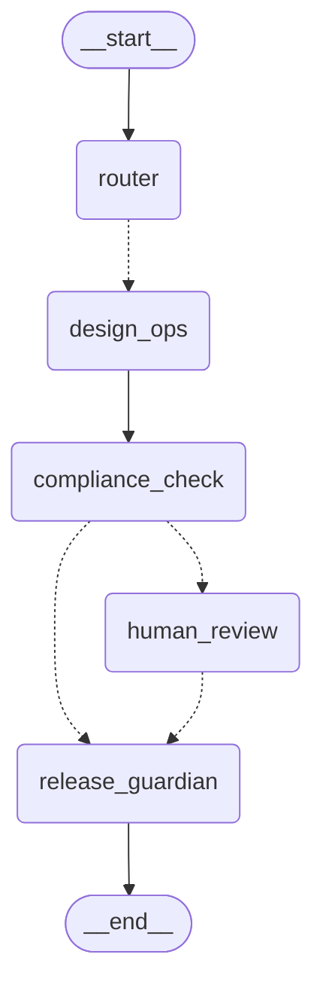

# LangGraph Governance Orchestration (Phase 4)

Multi-agent orchestration for research governance workflows using LangGraph state machine.

## Overview

The governance orchestrator coordinates multiple agents through design, compliance, review, and release phases using LangGraph. It provides:

- Multi-agent task routing and coordination
- FAVES compliance checking (Fidelity, Accessibility, Variability, Explainability, Safety)
- Human review gates for escalations
- Release authorization guardrails
- Event logging and metrics collection
- Graph visualization and introspection

## Architecture

### Graph Structure

```
┌─────────┐
│ Router  │ (Entry point - classifies task type)
└────┬────┘
     │
     ├─→ Design Operations (design tasks)
     ├─→ Specification Operations (spec tasks)
     ├─→ Compliance Check (compliance tasks)
     └─→ Release Guardian (release tasks)
          │
          ↓
     ┌─────────────────┐
     │ Compliance Gate │ (FAVES evaluation)
     └────┬─────┬──────┘
          │     │
          │     └─→ Human Review (if failed/pending)
          │          │
          ↓          ↓
     ┌──────────────────────┐
     │ Release Guardian     │ (Final authorization)
     └─────────────┬────────┘
                   │
                   ↓
                 [END]
```

### Components

#### State Types (`state.py`)
- `GovernanceState`: Shared state TypedDict for all agents
- `ReviewRequest`: Human review request with metadata
- `ComplianceCheckResult`: FAVES evaluation results
- `ReleaseApproval`: Release gate decision record
- `AgentMessage`: Communication between agents

#### Routing Functions (`routing.py`)
- `route_by_task_type`: Initial task classification routing
- `route_by_faves_status`: Compliance check result routing
- `route_by_approval`: Human review decision routing
- `route_by_release_decision`: Release guardian routing
- `should_escalate_to_stakeholder`: Risk-based escalation logic

#### Node Implementations (`nodes.py`)
- `router_node`: Entry point classification
- `design_ops_node`: Design specification generation
- `spec_ops_node`: Technical specification generation
- `compliance_node`: FAVES compliance evaluation
- `human_review_node`: Human review gate
- `release_guardian_node`: Final authorization gate

#### Graph Functions (`graph.py`)
- `create_governance_graph()`: Create base graph
- `create_governance_graph_with_config()`: Create with options
- `visualize_graph()`: Generate Mermaid diagram
- `GovernanceOrchestrator`: High-level wrapper class

#### Callbacks (`callbacks.py`)
- `OrchestrationLogger`: Event logging and export
- `NotificationHandler`: Workflow notifications
- `MetricsCollector`: Performance metrics

## Usage

### Basic Example

```python
from agents.orchestrator import get_orchestrator

# Create orchestrator
orchestrator = get_orchestrator()

# Execute a task
final_state = orchestrator.execute_task(
    task_id="task_001",
    task_type="design",
    task_description="Create system design specification",
    created_by="user_123",
)

# Access results
print(f"Status: {final_state['review_status']}")
print(f"Compliant: {final_state['is_compliant']}")
print(f"Can Proceed: {final_state['can_proceed']}")
```

### Task Types

- **design**: Design operations - generates design specifications
- **spec**: Specification operations - creates technical specifications
- **compliance**: Direct compliance checking
- **release**: Direct release authorization

### Advanced Usage

```python
from agents.orchestrator import GovernanceOrchestrator
from agents.orchestrator.state import create_initial_state

# Create orchestrator with custom config
config = {
    "checkpointer_type": "memory",
    "enable_visualization": True,
    "debug_mode": True,
}
orchestrator = GovernanceOrchestrator(config)

# Execute task with custom execution config
final_state = orchestrator.execute_task(
    task_id="task_002",
    task_type="spec",
    task_description="Write API specification",
    created_by="spec_writer",
    config={
        "configurable": {
            "thread_id": "task_002",
            "checkpoint_ns": "spec_workflow",
        }
    },
)

# Visualize the graph
print(orchestrator.visualize())

# Get metrics
metrics = orchestrator.get_metrics()
print(f"Tasks processed: {metrics['tasks_processed']}")
print(f"Avg time: {metrics['avg_processing_time']:.2f}s")

# Export event logs
orchestrator.export_logs("governance_log.json")
```

### Routing Logic

#### Task Type Routing
```python
from agents.orchestrator import route_by_task_type
from agents.orchestrator.state import create_initial_state

state = create_initial_state(
    task_id="test",
    task_type="design",
    task_description="Test",
    created_by="user",
)

next_node = route_by_task_type(state)  # Returns: "design_ops"
```

#### FAVES Status Routing
```python
from agents.orchestrator import route_by_faves_status

state["faves_status"] = "fail"
next_node = route_by_faves_status(state)  # Returns: "human_review"
```

#### Approval Routing
```python
from agents.orchestrator import route_by_approval

state["review_status"] = "approved"
next_node = route_by_approval(state)  # Returns: "release_guardian"
```

## State Management

### Creating Initial State

```python
from agents.orchestrator.state import create_initial_state

state = create_initial_state(
    task_id="task_001",
    task_type="design",
    task_description="Design the system",
    created_by="architect",
)
```

### Modifying State

```python
from agents.orchestrator.state import (
    add_message,
    add_error,
    add_agent_output,
)

# Add a message
state = add_message(
    state,
    sender="design_ops",
    content="Design specifications created",
    message_type="output",
)

# Record an error
state = add_error(
    state,
    agent="compliance_check",
    error_message="Safety score below threshold",
    error_type="compliance_error",
)

# Store agent output
state = add_agent_output(
    state,
    agent_name="design_ops",
    output={"specs": "..."},
)
```

## FAVES Compliance Framework

The compliance gate evaluates outputs against five criteria:

| Criterion | Description | Threshold |
|-----------|-------------|-----------|
| **Fidelity** | Accuracy and correctness of output | ≥ 0.80 |
| **Accessibility** | Usability and clarity for audience | ≥ 0.80 |
| **Variability** | Handling of edge cases and scenarios | ≥ 0.80 |
| **Explainability** | Documentation and justification | ≥ 0.80 |
| **Safety** | Security and risk mitigation | ≥ 0.80 |

All criteria must pass for workflow to proceed without human review.

## Graph Visualization

### Generate Mermaid Diagram

```python
orchestrator = get_orchestrator()
diagram = orchestrator.visualize()
print(diagram)
```

The diagram shows:
- All nodes and their names
- Connections between nodes
- Conditional routing paths (dotted lines)
- Direct paths (solid lines)
- Start and end points

### Example Output



## Metrics and Monitoring

### Accessing Metrics

```python
metrics = orchestrator.get_metrics()

print(f"Tasks Processed: {metrics['tasks_processed']}")
print(f"Tasks Completed: {metrics['tasks_completed']}")
print(f"Tasks Failed: {metrics['tasks_failed']}")
print(f"Avg Processing Time: {metrics['avg_processing_time']:.2f}s")
print(f"Node Timings: {metrics['node_timings']}")
print(f"Routing Decisions: {metrics['routing_decisions']}")
```

### Event Logging

```python
# Get event log
events = orchestrator.get_event_log()

# Events include: node_entry, node_exit, routing_decision,
# agent_output, compliance_check, review_request, error, task_complete

# Export to JSON
orchestrator.export_logs("governance_events.json")
```

## Error Handling

The orchestrator handles errors gracefully:

1. **Validation Errors**: Invalid state transitions
2. **Execution Errors**: Node processing failures
3. **Routing Errors**: Invalid routing decisions
4. **Compliance Errors**: FAVES check failures

All errors are logged with:
- Agent name
- Error message
- Error type
- Timestamp
- Execution context

```python
final_state = orchestrator.execute_task(...)

if final_state['errors']:
    for error in final_state['errors']:
        print(f"Agent: {error['agent']}")
        print(f"Error: {error['message']}")
        print(f"Type: {error['type']}")
```

## Testing

### Running Tests

```bash
cd /path/to/orchestrator
python test_orchestrator.py
```

### Test Coverage

- Orchestrator creation
- Graph visualization
- Task execution (all task types)
- Routing logic (all routing functions)
- State management (state utilities)
- Metrics collection
- Event logging

## Configuration

### Checkpointer Types

- **memory**: In-memory checkpointing (default)
- **redis**: Redis-based persistence (requires redis dependency)

### Debug Mode

Enable detailed logging:

```python
config = {"debug_mode": True}
orchestrator = GovernanceOrchestrator(config)
```

### Custom Checkpointing

```python
from langgraph.checkpoint.memory import MemorySaver

memory = MemorySaver()
# Pass to graph compilation
```

## File Structure

```
orchestrator/
├── __init__.py              # Package initialization and exports
├── state.py                 # State types and utilities
├── routing.py               # Conditional routing logic
├── nodes.py                 # Node implementations
├── graph.py                 # Graph creation and orchestrator class
├── callbacks.py             # Logging, notifications, metrics
├── test_orchestrator.py     # Test suite
└── README.md               # This file
```

## Integration Points

### With Research Workflow

The orchestrator integrates with the ResearchFlow workflow at governance checkpoints:

1. **Design Phase**: Design specifications creation
2. **Compliance Phase**: FAVES evaluation
3. **Review Phase**: Human governance review
4. **Release Phase**: Final authorization

### With External Systems

- **Event System**: Publishes workflow events
- **Notification System**: Sends review requests and decisions
- **Audit System**: Records all governance decisions
- **Metrics System**: Exports performance data

## Linear Issues

- ROS-30: LangGraph Agent Orchestration Infrastructure
- ROS-103: Composio + LangSmith Integration

## Related Files

- Agents: `/services/worker/src/agents/`
- Base Agent: `/services/worker/src/agents/base_agent.py`
- Requirements: `/services/worker/requirements.txt`

## Dependencies

- langgraph >= 0.2.0
- langchain >= 0.3.0
- langchain-anthropic >= 0.2.0
- langchain-openai >= 0.2.0
- redis >= 5.0.0 (optional)

## License

See main project LICENSE file.

---

**Last Updated**: 2026-01-30
**Version**: 1.0.0
